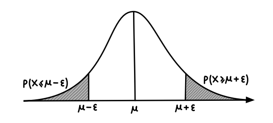

class: inverse, center, middle

# Get Started

---

# Indicator Functions
Given an arbitrary set $Ω$ and $A ⊆ Ω$, the **indicator function** of $A$ is $\mathbb{I}_A : Ω \rightarrow \{0, 1\}$ given by
$$\mathbb{I}_A(\omega) = \begin{cases}
1 & \omega\in A;\\
0 & o.w.
\end{cases}$$

--

 
 
 
 
 
Similarly, we will often write $\mathbb{I}\{\text{predicate}(X,Y,...)\}$ to mean the indicator function of the subset of $Ω$ on which the predicate is true.

---

# Filtrations
**Online Learning**

Each time data is received, the model makes predictions about it, updates the current model, and processes the next data.

--

** $\sigma$-algebra ** Think of it as a set of events. A $\sigma$-algebra generated by a collection of subsets $\mathcal{C}$ denoted by $\sigma(\mathcal{C})$.

--

In the study of online settings, information is revealed to the learner sequentially. Let $X_1,...,X_n$ be a collection of random variables on a common measurable space $(Ω,F)$. We imagine a learner is sequentially observing the values of these random variables. First $X_1$, then $X_2$ and so on. The learner needs to make a prediction, or act, based on the available observations.

Then, having observed $X_{1:t} \doteq (X_1,...,X_t)$, we have $σ$-algebra $F_t = σ(X_{1:t})$ (It is easy to check that $F_0⊆F_1⊆F_2⊆···⊆F_n⊆F$). A **filtration** is a sequence $(F_t)^n_{t=0}$.

---

# Conditional Probabilities

Conditional probabilities are introduced so that we can talk about how probabilities should be updated when one gains some partial knowledge about a random outcome.

--

The importance of conditional probabilities $P (A | B)$ is that they define a calculus of how probabilities are to be updated in the presence of extra information $(B)$.
$$P (A | B) = \frac{P (A ∩ B)}{P(B)} .$$

--

We introduce the famous *Bayes rule* :
$$P (A | B) = \frac{ P(B|A)P(A)}{P(B)} .$$

--

The probability $P(A|B)$ is also called the a **posteriori** (‘after the fact’) probability of $A$ given $B$. The a **priori** probability is $P (A)$.

---

# Concentration of Measure
>obtaining upper bounds on the tail probability

--

 
**Sample/empirical mean** Noted by $\hat\mu$, a common estimator of **popolation mean** $μ$.
$$\frac{1}{n}\sum^n_{i=1}X_i$$.

--

How far from $μ$ do we expect $\hat\mu$ to be?

--

A common measure is **variance**, $V[\hat\mu] = E[(\hat\mu − \mu)^2] = \frac{\sigma^2}{n}$,
which means that we expect the squared distance between $μ$ and $\hat\mu$ to shrink as $n$ grows large at a rate of $1/n$ and scale linearly with the variance of $X$. This is known as **expected squared error**. But this does not tell us very much about the distribution of the error.

---

# Tail Probabilities

We are insterested in the probability that $\mu$ is at least $\varepsilon$ away from the $\mu$.

.right[]

--

$\mathbb{P} (\hatμ ≥ μ + ε)$  and  $\mathbb{P} (\hatμ ≤ μ − ε) .$

--

Specifically, the first is called the **upper tail probability** and the second the **lower tail probability**. Analogously, $\mathbb{P} (|\hatμ − μ| ≥ ε)$ is called a **two-sided tail probability**.

---

# Bound the tails by two famous inequalities

## .uw-red-dark[Markov’s inequality]
$$\mathbb{P}(|X|\geq\varepsilon)\leq\frac{\mathbb{E}[|X|]}{\varepsilon}$$;

## .uw-red-dark[Chebyshev’s inequality]
$$\mathbb{P}(|X-\mathbb{E}[X]|\geq\varepsilon)\leq\frac{\mathbb{V}[X]}{\varepsilon^2}$$.

---
class: center, middle

background-image: url(https://www.google.com/url?sa=i&url=https%3A%2F%2Fa2ru.org%2Fmembers%2Funiversity-of-wisconsin-madison%2F&psig=AOvVaw0PJjR9RrKFb-eMp2d7cdH8&ust=1672495581666000&source=images&cd=vfe&ved=2ahUKEwin88TZwaH8AhX7nokEHZ-wCAMQjRx6BAgAEAo)

# Thanks!

### [.uw-red-dark[xiang.li2@wisc.edu]](xiang.li2@wisc.edu)

### [.uw-red-dark[Linkedin]](https://www.linkedin.com/in/xiang-li-202445204/)
